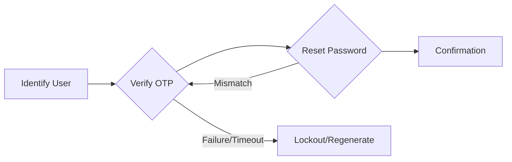

---
# Automated Security Registry Update
title: VaultVerify
emoji: 🔐
colorFrom: blue
colorTo: indigo
sdk: docker
pinned: false
---

<div align="center">


# 🔐 VaultVerify: Advanced Password Recovery Engine
### High-Efficiency Identity Simulation for Modern Web Applications

[](https://opensource.org/licenses/MIT)
[](https://dotnet.microsoft.com/en-us/apps/aspnet)
[](https://www.sqlite.org/index.html)
[](https://en.wikipedia.org/wiki/One-time_password)

---

**VaultVerify** is a sophisticated ASP.NET Core MVC simulation engine designed to replicate enterprise-level password recovery and account security protocols. It balances user experience with rigorous security measures, including time-sensitive OTP validation, multi-stage identity verification, and deep audit logging.

### 🚀 **[Try VaultVerify Live on Hugging Face](https://huggingface.co/spaces/maviyamustahsin/VaultVerify)** 🚀

[Explore Features](#-core-capabilities) • [System Flow](#-architecture--logic) • [Installation](#-quick-start) • [Security](#-security-features)

</div>

---

## 🌟 Core Capabilities

VaultVerify demonstrates a production-ready security workflow within a lightweight, modular architecture.

- **🛡️ Identity Assurance**: Multi-step verification pipeline (Identification → OTP Verification → Password Reset → Success Confirmation).
- **⚡ Proactive Security Measures**:
  - **Dynamic OTP Engine**: Generates 6-digit cryptographic tokens with a strict 60-second expiration.
  - **Brute-Force Shield**: Intelligent account lockout after 3 failed login or verification attempts (3-minute penalty).
  - **Secure Storage**: Leverages `PasswordHasher<User>` for industry-standard credential encryption.
- **📊 Comprehensive Audit Logs**: Real-time tracking of security events, including IP addresses, timestamps, and action details stored in SQLite.
- **🚀 Developer-First Seeding**: Automatically populates the environment with real emails and 100+ bulk test accounts upon initial launch.
- **🔒 Privacy Headers**: Custom middleware to disable browser caching on sensitive pages, preventing data exposure on shared computers.

---

## 🏗️ Architecture & Logic

The system follows a strict state-machine logic to ensure users cannot skip verification steps.



### 🗄️ Database Schema
| Model | Key Fields | Purpose |
| :--- | :--- | :--- |
| **User** | `Email`, `Password`, `OtpCode`, `OtpExpiry`, `LoginAttempts` | Core user identity & security state |
| **AuditLog** | `Action`, `Email`, `IPAddress`, `Timestamp`, `Details` | Immutable record of system interactions |

---

## 🖥️ Platform Showcase


*VaultVerify provides a clean, responsive interface powered by Bootstrap, optimized for both desktop and mobile accessibility.*

---

## 🚀 Quick Start Guide

### Prerequisites
*   [.NET SDK 8.0+](https://dotnet.microsoft.com/download)
*   Visual Studio or VS Code

### 🛠️ Execution Steps

1. **Clone the Project**:
    ```ps1
    git clone https://github.com/maviyamustahsin/VaultVerify.git
    cd VaultVerify/ResetApp
    ```

2. **Initialize & Seed**:
    The system uses an embedded SQLite database. Run the following command to auto-generate the database and seed the initial users:
    ```ps1
    dotnet run
    ```

3. **Verify Seed Emails**:
    Try identifying with `securecheck20s2@gmail.com`. The OTP will be visible in the **Console Output** for testing purposes.

---

## 🛡️ Security Features

- **Global CSRF Protection**: All POST actions are secured with `[ValidateAntiForgeryToken]`.
- **HSTS Ready**: Pre-configured for strict HTTPS requirements.
- **Identity Abstraction**: Clean separation between security logic and UI rendering.
- **Console Debugging**: Development-mode OTP logging to ensure a smooth developer experience.

---

<div align="center">

Built for the **VaultVerify** repository by [maviyamustahsin](https://github.com/maviyamustahsin).

[🔼 Back to Top](#-vaultverify-advanced-password-recovery-engine)

</div>
